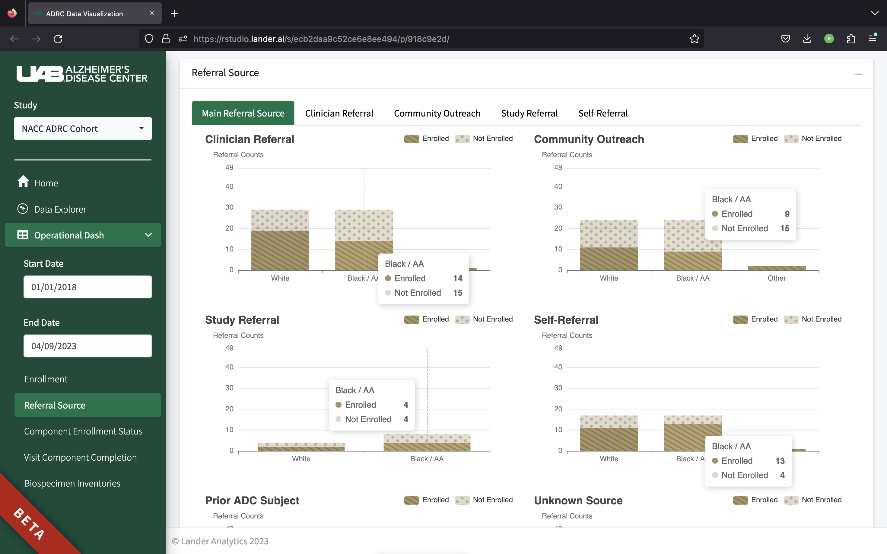

# ADRCDash

<!-- badges: start -->

<!-- badges: end -->

Current developmental version of the UAB ADRC Dashboard

=======

 

Dashboard showing core metrics for the University of Alabama at Birmingham Alzheimer's Disease Center.

 

  

 

## Directory structure

    .
    ├── /data                        # Temporary synthetic data
    ├── /dev                         # `golem` scripts for recordkeeping
    ├── /inst
    |    └── /app
    |        └── /www                # Files to make available to the browser during runtime
    ├── /man                         # Documentation for exported functions
    ├── /R                           # R functions
    ├── /renv                        # Files for `renv` dependency management
    ├── /tests                       # Unit tests
    ├── DESCRIPTION
    ├── ADRCDash.Rproj
    ├── NAMESPACE
    ├── renv.lock
    └── README.md

 

## Running the app 

#### Data

`/data` directory is to temporarily house synthetic data. Real data to come from REDcap. Data is currently loaded into the app via the `load_data()` function placed in the `app_server`.

#### Local developer environment

Clone the repository to your machine use `git clone` in terminal. Run `renv::restore()` in R to download the dependencies. Run `golem::run_dev()` to launch the app.

#### Deploying to Connect

You can manually deploy to your Connect server by running `rsconnect::deployApp()` within your R console or by opening `app.R` and clicking the blue button in the top right. Please upload the entire package when prompted.

#### Deploying as a local package

The Shiny application can be bundled as a tarball and distributed as a R package. Run `devtools::build()` to create the tarball. Make sure any data files are removed prior to build or they may be included in the tarball.  

 

## Dependencies

[`renv`](https://rstudio.github.io/renv/index.html) is used to manage dependencies. You can use `renv::restore()` to install all the necessary packages. Do not add `ADRC` as a dependency even if `renv` suggests it. `renv.lock` contains a manifest of the R version, the packages and their versions, and the repositories.

 

## Application structure

The application is built on [R Shiny](https://mastering-shiny.org/index.html) and uses the [`golem`](https://thinkr-open.github.io/golem/) opinionated framework. 

#### golem

It is encouraged to familiarize yourself with the [`golem` site](https://thinkr-open.github.io/golem/) and the [Engineering Shiny](https://engineering-shiny.org/golem.html) book to understand the framework. `golem` is an opinionated framework that builds shiny apps as R packages. Structuring your code as modules is highly encouraged. 

At a minimum, be familiar with the `/dev/02_dev.R` script and `/dev/run_dev.R`. The former keeps a record of adding new modules, tests, functions, etc. The latter should be sourced when running the app for development purposes.

#### Creating a new page

The UI is built on [`bs4Dash`](https://rinterface.github.io/bs4Dash/) framework. It roughly matches the popular [`shinydashboard`](https://rstudio.github.io/shinydashboard/) layout where the navigation sidebar and body is set then filled in with individual content. This content can be set directly within `app_ui.R` or within a module. 

The UI code can be directly written in the `app_ui.R` and `app_server.R` files with the core functionality written as functions in seperate scripts within `/R`.
- `app_ui.R`: Add your UI code in two places. Follow the pattern in the `bs4Dash::dashboardBody` and `bs4Dash::dashboardSidebar` function calls  
- `app_server.R`: Add your server code near the bottom 

Note that it is recommended, but not necessary, to use modules for new pages.

 

## Testing

- [`roxygen2`](https://roxygen2.r-lib.org/) is used for documenting functions  
- [`testthat`](https://testthat.r-lib.org/) for unit testing  
<!-- - [`shinyloadtest`](https://rstudio.github.io/shinyloadtest/) for load testing  -->

#### Unit tests

Unit tests are written using `testthat` and can be found in the `/tests/testhat` directory. Run `devtools::test()` to run the tests at will. Add new tests by either manually adding to the current scripts, adding a new script within the `/tests/testhat` directory, or (preferably) within `dev/01_dev.R` script.

<!--

#### Load tests

Load testing is performed using `shinyloadtest`. See `tests/loadtest/README.md` for details.

-->
